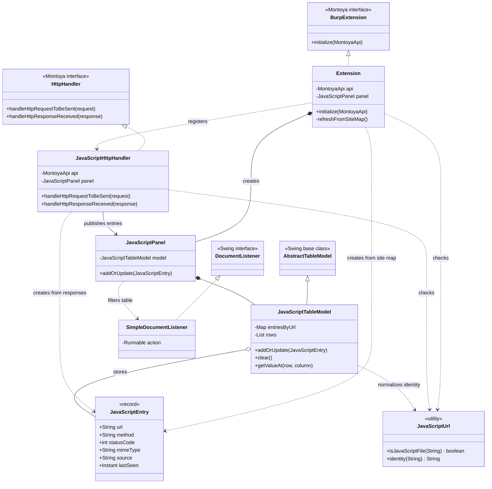
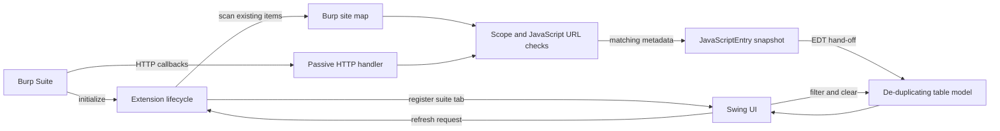
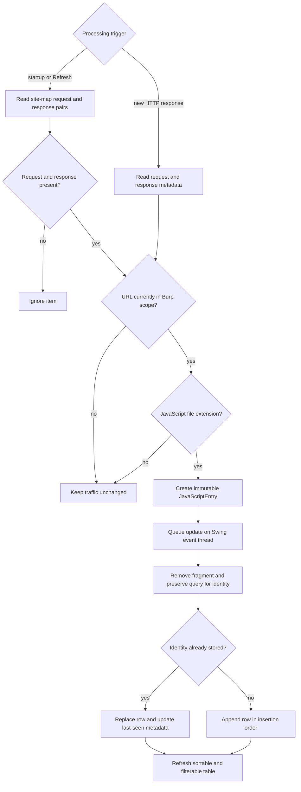

# Architecture and processing flow

This document is the editable diagram source for **JS in Scope**. Mermaid-enabled Markdown viewers
render the diagrams directly. They reflect `src/main/java/dev/burpext/jsinscope`.

## Class diagram

## Component diagram

## Resource processing flow

Startup/site-map refreshes and newly received responses share the same validation path. Site-map rows
use `SITE_MAP` as their source; live rows use the name of Burp's originating tool.

## Threading model

- Burp initialization creates the panel synchronously on Swing's Event Dispatch Thread (EDT).
- Site-map scans run on a daemon worker thread to avoid freezing the interface.
- Burp invokes HTTP callbacks on its own worker threads.
- Both producers call `JavaScriptPanel.addOrUpdate`, which queues model mutation on the EDT.
- The extension observes traffic only and returns every original request and response unchanged.
